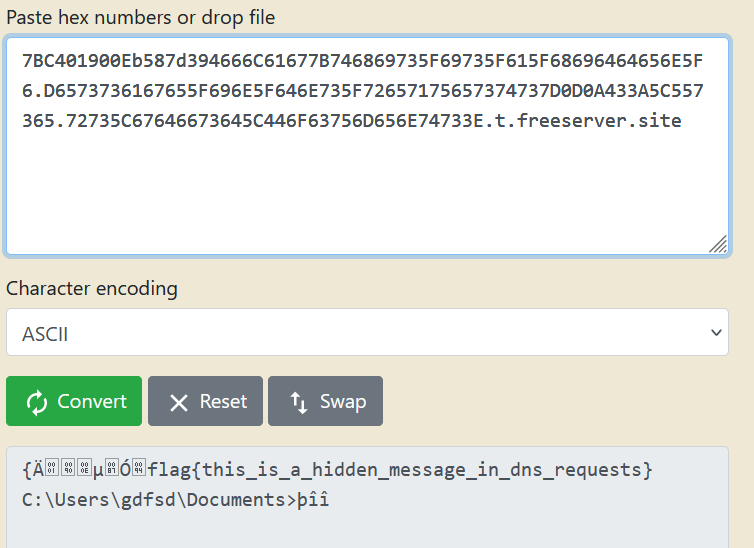
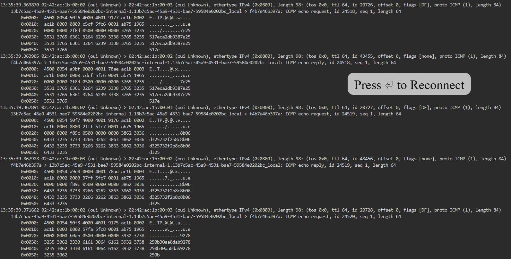

### Угадай хеш
#### The condition of a given task:
<code>📃 Описание задания
\
Вам необходимо по внешнему виду хеша определить его тип.
\
💡 Подсказка к решению
\
Не пользуйтесь сторонними программами и сервисами, они вас лишь замедлят.</code>

#### Solution:
just use `https://suip.biz/ru/?act=hashtag` or `hashid` to detect type of the hash
forgot valid flag but one of the actual is

Answer is:
***719cd9f619da1b4362c29f0eb2227295b5e197bdfd7c749f0ff2c35ff20e66dd022b4f9ff33e31bdfcf18bd687032a1e***

***

### IPTables
#### The condition of a given task:
<code>Вам дан дамп правил межсетевого экрана Iptables. Правила добавлялись в хаотичном порядке и перекрывали адреса подсететей откуда шли атаки. Кажется, что сервер теперь успешно изолирован от всего интернета. Или нет? Найдите адреса, которые остались незаблокированными из подсети 112.0.0.0/4.</code>

#### Solution:
Let's check what inside your [_iptables-dump.txt_](https://lms.itmo.xyz/uploads/xtmbkf1urtps34rn2mcp3it56i96myc6/iptables-dump.txt)
filter it by regex <code>\b(?:[0-9]{1,3}\.){3}[0-9]{1,3}\/\d{1,2}\b</code>

At first sort subnets in ascending order of bit length in the mask and check that *you have full path from /4 to /32*(_single adress_) keep in mind that **every step you're halving your not whitelisted subnet**. 
112.0.0.0/4 means 112.0.0.0-127.255.255.255
112.0.0.0/5 means 112.0.0.0-119.255.255.255
so now the _remaining non-blocked addresses_ is **120.0.0.0-127.255.255.255**
124.0.0.0/6 means 124.0.0.0-127.255.255.255
120.0.0.0/7 means 120.0.0.0-121.255.255.255
so now the _remaining non-blocked addresses_ is **122.0.0.0-123.255.255.255**
step by step it's a verbal exercise

>full solution here below on the rignt side alive adresses ranges
Main subnet is 112-127.0.0.0 16
112.0.0.0/5 120-127  
124.0.0.0/6 120-124  
120.0.0.0/7 122-124  
122.0.0.0/8 123-124  

>first bite is 123

>123.128.0.0/9  123.0-128  
123.64.0.0/10  123.0-64  
123.32.0.0/11  123.0-32  
123.0.0.0/12 123.16-32  
123.24.0.0/13 123.16-24 
123.20.0.0/14 123.16-20 
123.18.0.0/15 123.16-18 
123.17.0.0/16 123.16 

>second bite is 16

>123.16.128.0/17 123.16.0-128
123.16.64.0/18  123.16.0-64
123.16.32.0/19  123.16.0-32
123.16.16.0/20  123.16.0-16
123.16.0.0/21   123.16.8-16
123.16.12.0/22  123.16.8-12
123.16.10.0/23  123.16.8-10
123.16.9.0/24   123.16.8

>third bite is 8

>123.16.8.128/25 123.16.8.0-128
123.16.8.64/26  123.16.8.0-64
123.16.8.32/27  123.16.8.0-32
123.16.8.16/28  123.16.8.0-16
123.16.8.0/29   123.16.8.8-16
123.16.8.12/30  123.16.8.8-12
123.16.8.10/31  123.16.8.8-10
123.16.8.9/32   123.16.8.8

>last bite is 8

Answer is: ***123.16.8.8***

***

### DNS Hidden Record
#### The condition of a given task:
<code>⚠️ Подключитесь к VPN сети.
\
Вам доступен DNS сервер. Попробуйте получить как можно больше информации о домене hiddentext.osint. Ответом к данному заданию является строка, которую можно извлечь (вида 98355ba9fcc21782ec6f16975413bb011fe7effb87bce04f551f60944352aa568d25f8782187c89787a9f27cff88).
\
Подсказка
\
Например, вам был сгенерирован следующий IP: 10.10.10.10:49666. Это значит, что DNS сервер располагается на сервере с адресом 10.10.10.10 и слушает на порту 49666.</code>

#### Solution:
*turn on* your *vpn* and try to `dig @10.10.10.10 -port <your_port> hiddentext.osint txt` 
Obviously, the *text is stored in a txt record* (usually it is), so let's see what txt records this domain has.
and he has a *txt record with our flag*.

Answer is: ***4f9ccb5104ad6b34a10576732e85e9ba5b1b650abcd1500d4908fce7a84e8806f06c341e3f46d78d38a2265f0f0eb785***

***

### DNS туннель
#### The condition of a given task:
<code>Вам дана запись сетевого трафика (PCAP файл). Известно, что передача информации происходила внутри DNS туннеля. Извлеките флаг.</code>

#### Solution:
At first open [_dnstunnel.pcapng_](https://lms.itmo.xyz/uploads/rb2dgvfty7c7vo1ieftc1jyn5021cdh1/dnstunnel.pcapng) in wireshark and try filter like `dns.qry.name.len > 100 && !mdns` for detect _dns tunnels_
now you can see smth like  and find out that long dns query name seems like plaintext in hex
check this theory  
and try (www.rapidtables.com)[https://www.rapidtables.com/convert/number/hex-to-ascii.html]
_show the result_!! 
(bruteforce any of this dns query names to find out flag)

Answer is: ***flag{this_is_a_hidden_message_in_dns_requests}***

***

### DNS subdomains
#### The condition of a given task:
<code>Вам доступен DNS сервер. Сколько поддоменов содержится в зоне hosting.osint? 
\
Поддомены – короткие (до 6 символов) распространенные английские слова строчными буквами без специальных символов.
\
Подсказка
\
Например, вам был сгенерирован следующий IP: 10.10.10.10:49666. Это значит, что DNS сервер располагается на сервере с адресом 10.10.10.10 и слушает на порту 49666. 
\
Обратите внимание, на каком транспортном протоколе по умолчанию работает DNS?</code>

#### Solution:
*turn on* your *vpn* and try to `gobuster dns -d hosting.osint -w <path/to/your/wordlist> -r 10.10.10.10:<your_port> -q -o output` 
it's **biggest dogshit in tasks** that i solved...
`./massdns -r <file with 10.10.10.10:<your_port>> -t A -o S -w <outputfile> <wordlist>`
Answer is: ***688***

***

### DNS very special domain
#### The condition of a given task:
<code>⚠️ Подключитесь к VPN сети.
\
Вам доступен DNS сервер.Какой IP адрес имеет домен, IP которого отличается от всех остальных (в зоне hosting.osint)? Искомые поддомены – короткие (до 6 символов) распространенные английские слова строчными буквами без специальных символов.
\
Подсказка
\
Например, вам был сгенерирован следующий IP: 10.10.10.10:49666. Это значит, что DNS сервер располагается на сервере с адресом 10.10.10.10 и слушает на порту 49666.</code>

#### Solution:
with your domain list you can *bruteforce* answer via *this command*:
`cat <path/to/domains/list> | while read domain; do dig @10.10.10.10 -p <your_port> $domain A +noall +answer | grep -v 1.2.3.4; done`
grep -v **1.2.3.4** cause all except one domains have ip `1.2.3.4`
in output we can see that domain *talk.hosting.osint* has ipv4 *172.168.9.19*  

Answer is: ***172.168.9.19***

***

### Прослушка
#### The condition of a given task:
<code>Вам дан доступ к виртуальной машине по SSH (логин: user, пароль: user).Известно, что в сети с данной машиной расположена ещё одна, которая переодически пересылает секретную информацию по одному из распространенных протоколов.</code>

#### Solution:
at first do `arp -a` and see that we have only *one* host in out network
this host have ip **172.19.0.2** and name **trafik.task**
we can scan ports with *nc* via `for port in {1..65535} do nc -zv 172.19.0.2 $port done` 
see that *172.19.0.2* has two open ports: **80** and **8080**
with `wget 172.19.0.2:8080` we can see index.html of this web page
***no way dead end road***

**better try use `tcpdump` cause you can detect some packets**
in log we see a requests like <code>11:46:39.405189 IP (tos 0x0, ttl 64, id 16566, offset 0,flags [DF], proto UDP (17), length 144)
884c13fa-449d-43a7-bdbf-fcebab8b7084-checker-sender-1.884c13fa-449d-43a7-bdbf-fcebab8b7084_local.52582 > 255.255.255.255.5005: [bad udp cksum 0xc138 -> 0x3bb5!] UDP, length 116</code>
and **tryna check payloads via opening dump file** that we can create and print via 
`tcpdump -w <filename>; cat <filename>` 
inside of it we see secret flag: `80453fa8dce79cd29ee5a79c321a744059dad0d78fceb7bff68de8f505f339b9aca66ad8beede13b0c99965fb98424c7`

Answer is: ***80453fa8dce79cd29ee5a79c321a744059dad0d78fceb7bff68de8f505f339b9aca66ad8beede13b0c99965fb98424c7***

***

### Raw ICMP
#### #### The condition of a given task:
<code>Известно, что ваш сосед по сети любит общаться через сообщения внутри ICMP протокола. Отправьте ему ICMP сообщение с текстом give me flag и будьте уверены, что он в ответ пришлет вам ICMP сообщение с флагом. Внимание, флаг обычно является строкой из примерно 92 латинских символов.
\
Подсказка: сервер отправляет сообщение с помощью ping -p</code>

#### Solution:
`apt install net-tools; arp -a` to discover hosts in out network
at first let's find host that responds to the request
`ping -i <network_interface>-s 12 -p 67697665206D6520666C6167 -b -c 1 255.255.255.255`
with something other than the usual echo reply like a path of flag(cause 16 bytes - limit) 
and we need tcpdump to check the payloads from **13b7c5ac-45a9-4531-bae7-59584e0202bc-internal-1.13b7c5ac-45a9-4531-bae7-59584e0202bc_local:(victim)** that answeres smth like 
keep in mind that maximum of bytes in payload is 16, and after first 16 bytes server repeats payload.
the flag has lenght like *92* bytes and we can take the first 16 bytes from every reply responce and contatinate it to get the flag

but be **careful with duplicates**

Answer is: ***7e25517eca2db9388b06d325732f2b8c9278250b30aa0dab8e61c66b01e039d3e7ef2ea67be5706f5058fee9e3607a3f***

***

